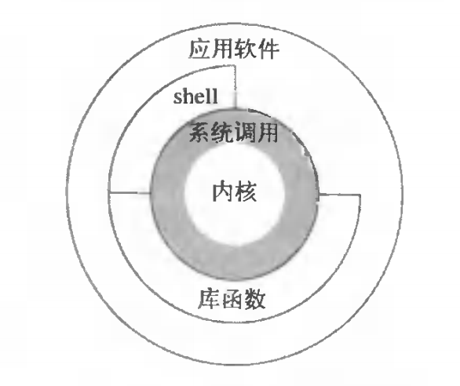

### 为什么会64位系统调用不需要陷入内核态？
看到标题的小伙伴，可以先猜测一下，为什么，64位系统能够不用陷入内核态，进行系统调用？
#### 什么是系统调用？
先来聊聊什么是系统调用。系统调用是计算机程序在执行过程中，向操作系统内核申请调用某系统方法。而我们现在进行系统调用的方式有下面几种。参考下图。


我们可以从shell，应用程序，以及库函数进行系统调用。在Linux系统中提供了glibc作为应用程序中介进行系统调用。glibc对系统调用进行了封装，给上层应用程序提供了接口。linux也是煞费苦心啊。
#### 系统调用过程是怎样实现的？
那系统调用是怎么实现的呢？
##### 先来32位系统调用的盗图。


我们先来看看这张图，程序从用户态调用open函数打开文件，glibc就会作为中介发挥作用，glibc通过syscalls.list文件将该open函数映射到对应的系统调用open，然后调用DO_CALL，DO_CALL的操作事先将请求参数都放在寄存器中并将系统调用映射的系统调用号存在eax寄存器中
，然后执行`ENTER_KERNEL`，进入软中断状态，这里的`ENTER_KERNEL`是一个宏定义

```
#define ENTER_KERNEL int $0x80
// int即interrupt
```
中断后，就开始进入执行`trap_init()`陷入内核，在陷入内核过程中，执行了SAVE_ALL 保存当前用当前用户态的寄存器到`pt_regs`结构里面，然后开始将eax里的系统调用号取出来，通过系统调用表获得系统调用。
```
#define ia32_sys_call_table sys_call_table
// 系统调用表
```
系统调用后就是iret了，返回就会重新将之前存的用户态的寄存器恢复，然后返回系统调用结果，然后返回给用户态程序。由此，cpu就这样，将整个调用的上下文状态维持住了。

##### 再来64位系统调用的盗图

相比32位系统调用，64为系统可是简洁多了，不整虚的，直接来个`syscall`指令开始系统调用，然后来个`sysretq`就结束了系统调用，返回给用户态。64位系统还是会将系统调用名转换成系统调用号，这次是放在rax，但是这里就不会中断，而是直接进入系统调用。
因为在64位系统中，内核在初始化时会调用syscall_init将entry_SYSCALL_64存入MSR寄存器(Model Specific Registers),特殊模块寄存器，实属牛批。
MSR寄存器是x86指令集中用于调试、追踪以及性能监控的控制寄存器。就是CPU为完成某些特殊控制功能为目的的寄存器，包括系统调用。<br>

64位还是会保存用户态上下文到寄存器，但是这里进行就不会进行中断，而是从MSR寄存器中读取已经初始化好的系统调用,`entry_SYSCALL64_slow_pat->do_syscall_64`。在`do_syscall_64`会从rax拿出系统调用号，然后在`sys_call_table`找到系统调用，执行系统调用，然后进行一个宏定义返回。
```
#define USERGS_SYSRET64 \
swapgs; \
sysretq
```
#### 为什么64位系统调用不需要陷入内核态？
emm，我的回答是，因为64位实现了MSR。主要是有了更多的位数了，内核初始化就能得到系统调用的映射了，也不用中断去找了，所以不用陷入内核态找，而是直接映射找到系统调用，直接调用了。

### 总结
系统调用离我们并不远，很近。近到你写的第一行hello world就会有很多个系统调用。所以先了解他，并深入他，你才能在应对某些程序崩溃时，能够有更深入的思考。
##### 参考文献
[为什么系统调用会消耗较多资源](https://draveness.me/whys-the-design-syscall-overhead/)
[系统调用 公司成立了就要开始接项目](https://time.geekbang.org/column/article/90394)