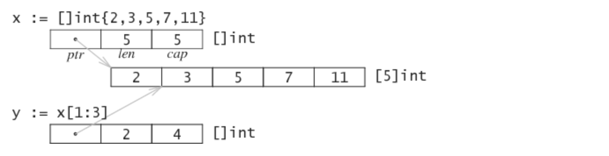
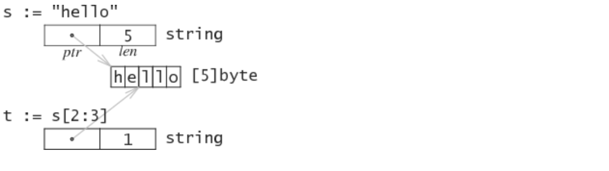

## 深入GO语言文本类型
Go中，字符串string是内置类型，与文本处理相关的内置类型还有符文rune和字节byte<br>
UTF-8编码再Go语言中有着特殊的位置，无论是源代码的文本编码，还是字符串的内部编码都是UTF-8。<br>
当Unicode增长超出BMP之后，这一优势也荡然无存，优势是早起有随机访问的优势。相比之下，字节序，SUrrogate，空间冗余带来的麻烦却让人头大。<br>

#### 标准库，大多数关于字符串处理的函数都放在标准库里 strings，bytes
因为字符串和整型间没有隐式类型转换，字符串和其他基本类型的功能主要在标准库strconv中提供。<br>
Unicode相关功能放在unicode包中提供。encoding包提供了一系列其他的编码支持。<br>

### abstract
* Go 总是采用UTF-8编码
* 字符串string可以包含任意字节序列，通常是UTF-8编码的
* 字符串字面值，在不带有字节转义的情况下一定是UTF-8编码的
* Go用rune代表Unicode码位。一个字符可能由一个或多个码位组成(复合字符)
* Go string是建立在字节数组的基础上的。因此对string使用[]索引会得到字节byte而不是字符rune
* Go语言的字符串不是正规化(normalized)的，因此同一个字符可能由不同的字节序列表示。使用unicode/norm解决此类问题

```go
func TestTypes(t *testing.T){
	t.Log("hello world!")
	var str string = "hello"
	t.Log(str[1])
	t.Log(str[0])
}
```
得到log为101或104，所以根据[]得到的是字节byte而不是字符rune<br>
那么如何得到字符？
```go
func TestTypes(t *testing.T){
	t.Log("hello world!")
	var str string = "hello"
	for _,c:= range str{
		t.Logf("%[1]c %[1]d",c)
	}
}
```
这样不是按索引访问的，那么按索引访问的怎么做？别急，且听我娓娓道来<br>
### 基础数据结构
##### 数组与切片
要讨论`[]byte`和`[]rune`，就必须先解释Go 语言中的数组(Array)与切片(Slice)，切片则是对数组的引用。<br>
数组Array是固定长度的数据结构，不存放任何额外的信息。很少直接使用，往往用作切片的底层存储。<br>
切片Slice描述了数组中一个连续的片段，Go语言的切片操作与Python较为类似。在底层实现中，切片可以看成一个由三个word组成的结构体，这里word是cpu的字长。这三个字分别是ptr，len，cap，分别代表数组首元素地址，切片的长度，当前切片头位置到底层数组尾部距离。<br>


因此，在函数参数中传递十个元素的数组，那么就会在栈上复制这十个元素。而传递一个切片，则实际上传递的是这个3Word结构体。传递切片本身就是传递引用。<br>

```go
func TestTypes(t *testing.T){
	t.Log("hello world!")
	var str string = "hello"
	for _,c:= range str{
		t.Logf("%[1]c %[1]d",c)
	}

	x:=[]int{1,2,3,4}
	t.Log(len(x),cap(x))
	x = append(x,14)
	t.Log(len(x),cap(x))

}
```
其实cap以两倍增长，len正常的长度，ptr就是获取某个数值<br>
##### 字节 BYTE
字节byte实际上是uint8的别名，只是为了和其他8Bit类型相区别才单独起了别名。通常出现的更多的是字节切片`[]byte`与字节数组`[...]byte`<br>

##### 字面值 rune
字节可以用单引号扩起的单个字符表示，不过这种字面值和rune的字面值很容易搞混。赋予字节变量一个超出范围的值，如果在编译期能够检查出来就会报overflows byte编译错误<br>

##### 底层结构
```go
type SliceHeader struct{
    Data uintptr
    Len int
    Cap int
}
```
##### 字符串 String
字符串通常是UTF8编码的文本，由一系列8bit字节组成。raw string literal 和不含转义富豪string literal一定是UTF-8编码的，但string其实可以含有任意字节序列。<br>
字符串是不可变对象，可以空(s:="")，但是不会是nil<br>
##### 底层结构
```go
type StringHeader struct{
    Data uintptr
    Len int
}
```


虽然字符串是不可变类型，但是通过指针和强制转换，还是可以进行一些危险但高效的操作的。不过，编译器作为常量确定的string会写入只读段，是不可以修改的。相比之下，fmt.Sprintf生成的字符串分配在堆上，就可以通过黑魔法进行修改。<br>
关于string
* string常量会在编译期分配到只读段，对应数据地址不可写入
* 相同的string常量不会重复存储，但动态生成的字符串没有设置数据地址，只有动态生成的string可以unsafe魔改
* Golang string和`[]byte`转换，会将数据复制到堆上，返回数据指向复制的数据。所以string(bytes)存在开销
* string和[]byte通过复制转换，性能损失接近4倍

##### 符文 RUNE
符文rune其实是int32的别名，表示一个Unicode的码位。<br>
一个字符(Character)可以由一个或多个码位(Code Point)构成。例如带音调的e，即é,既可以由\u00e9单个码位表示，也可以由e和口音符号\u0301复合而成。这涉及到normalization的问题。但通常情况下一个字符就是一个码位。<br>

符文的字面值是用单引号括起的一个或多个字符，例如a,啊,\a,\141,\x61,\u0061,\U00000061，都是合法的rune literal。
```go
rune_lit         = "'" ( unicode_value | byte_value ) "'" .
unicode_value    = unicode_char | little_u_value | big_u_value | escaped_char .
byte_value       = octal_byte_value | hex_byte_value .
octal_byte_value = `\` octal_digit octal_digit octal_digit .
hex_byte_value   = `\` "x" hex_digit hex_digit .
little_u_value   = `\` "u" hex_digit hex_digit hex_digit hex_digit .
big_u_value      = `\` "U" hex_digit hex_digit hex_digit hex_digit
                           hex_digit hex_digit hex_digit hex_digit .
escaped_char     = `\` ( "a" | "b" | "f" | "n" | "r" | "t" | "v" | `\` | "'" | `"` ) .
```
真麻烦！八进制的数字范围是0-255，Unicode转义字符通常要排除0x10FFFF以上的字符和surrogate字符。<br>
看上去单引号括起来的字面值像是一个字符串，但当源代码转换为内部表示时，他其实就是一个int32.所以`var b byte = '蛤'`，其实就是uint8赋了一个int32的值，就会导致溢出。相应的，一个rune也可以在不产生溢出的条件下，赋值给byte。<br>

##### 文本类型转换
三种基本文本类型之间可以相互转换，指针黑魔法和常规做法<br>
string与bytes常规转换<br>
```go
s:=string(b)
s[i] = b
s:=string(bytes)
bytes := []byte(s)
```
黑魔法: 利用unsafe.Pointer和reflect包可以实现很多禁忌的黑魔法，但是这些操作对GC不友好，最好不要尝试<br>
```go
type Bytes []byte
// 将string转换为[]byte，可以修改，很危险，因为[]byte结构要多一个cap字段
func StringBytes(s string) Bytes{
    return *(*Bytes)(unsafe.Pointer(&s))
}

// 不拷贝将[]byte转换为string
func BytesString(b []byte)String{
    // 因为[]byte的Header只比string的header多一个cap字段 可以直接强制成*String
    return *(*String)(unsafe.Pointer(&b))
}
// 获取&s[0],即存储字符串的字节数组的地址指针，Go里不允许这种操作
func StringPointer(s string) unsafe.Pointer{
    p := (*reflect.StringHeader)(unsafe.Pointer(&s))
    return unsafe.Pointer(p.Data)
}
// r获取&b[0] 即[]byte底层数组的地址指针 Go里不允许这种操作
func BytesPointer(b []byte) unsafe.Pointer {
    p := (*reflect.SliceHeader)(unsafe.Pointer(&b))
    return unsafe.Pointer(p.Data)
}
```
string与rune
```go
// rune to string
str := string(r)

// range string -> rune
for i,r := range str

// string to []rune
runes := []rune(str)

// []rune to string
str := string(runes)
const nihongo = "日本語"
for index, runeValue := range nihongo {
    fmt.Printf("%#U starts at byte position %d\n", runeValue, index)
}

U+65E5 '日' starts at byte position 0
U+672C '本' starts at byte position 3
U+8A9E '語' starts at byte position 6
```
直接索引string会得到字节序号和相应字节。而对string进行range迭代，获得的就是字符rune的索引与相应的rune。
##### BYTE与RUNE的转换
byte其实是uint8，而rune实际就是int32，所以uint8和int32两者之间的转换就是整数的转换。<br>
但是`[]uint8和[]int32`是两个不同类型的整形数组，它们之间是没有直接强制转换的方法的，好在通过string来曲线救国：runes := []rune(string(bytes))先string再rune