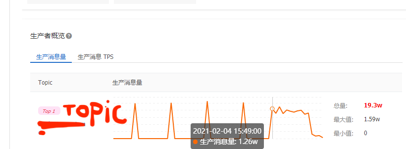
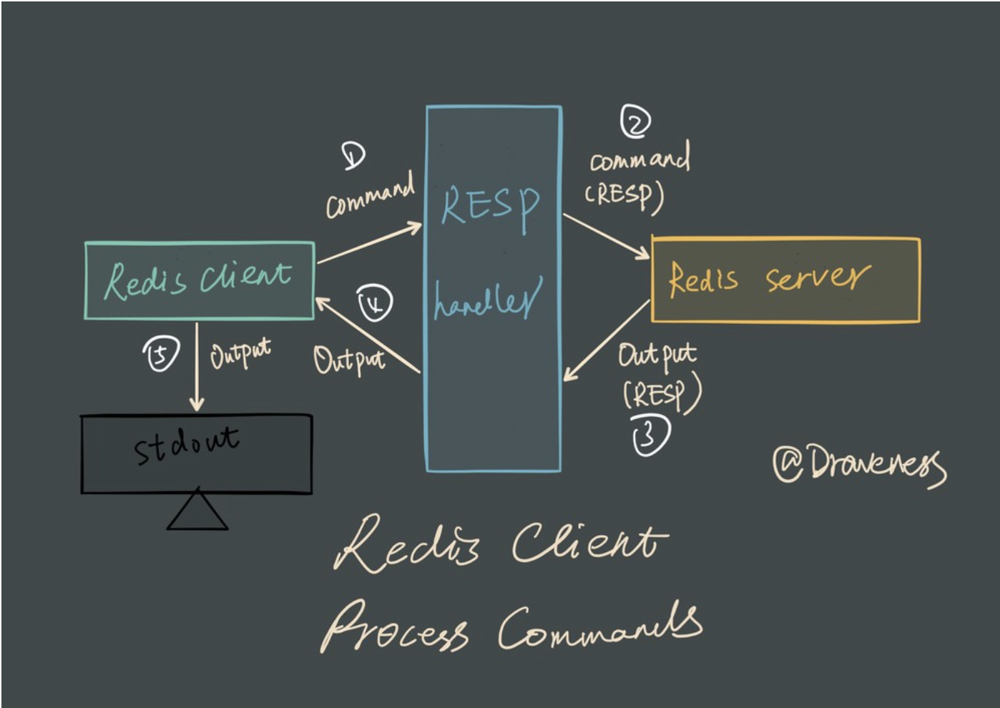

### 到底如何计算redis连接池大小？

### 事故剖析
事故现场：消息记录不正常，消息不能正常消费，导致数十万用户不能正常获取到正常推送。<br>
寻踪：查询日志发现redis错误频频爆出 redigo connection pool exhausted(备注：因架构使用redigo，所以报错会出现redigo)。<br>
深入redis代码位置：(涉及版权，给出的是伪代码)

```go
if err := redigo.SetVal(msgkey,val);err!=nil{
    return errors.WithStack(err)
}
```

由代码可以看出，该设值依赖的是底层的链接，而底层链接是设置了连接池，连接池设置了默认30的活跃链接。也就是30个链接用完了，没有还回去，就回爆出`connection pool exhausted`了。<br>
由于该值记录每条消息的键msgKey，所以调用方为消息消费方，马上追踪到消息消费方的消息量。<br>
消息生产量：

可以看出消息的每分钟生产量为每10分钟生产1w多条，而继续查看消息的消费最高速度为255/tps，可以看到，每分钟能大概处理1.5w条数据，但是为什么还会爆出连接池不够的错误？<br>
继续查看消息是否有堆积，结果不出所料，消息堆积超过200w条，原因，消费者每次执行完一分钟就被kill掉，导致消息的长时间都累积下来。这样每次，消息队列的数据都无法被消费掉，导致消息洪峰。<br>
最快的解决方案:
1. 加资源先解决消息堆积。例如加链接池数，查资料🉐️，redis能加到10000连接池，所以将redis连接活跃数加一倍。加pod，增加消费者，因应用是微服务，不同的pod拥有的独立的redis控制，所以可以加pod来处理。
2. 消息处理完后，减资源达到消息生产消费处理平衡。
一般最快的解决方案，都是资源比之前多一倍的方案。<br>
事故处理完后，虽然生产者与消费者之间的微妙平衡关系以及消息处理所使用计算机资源，可以通过消费者结合计算机资源的处理能力估算来把握，但是redis的连接池到底设置为多少才是合适的？所以有了以下回顾<br>
### 回顾
孔子和耶稣都讲过这样一句话：任何事都应该尽量简单，但不宜过于简单。<br>
#### 系统little定律
通用法则: 考虑一个带有输入输出的任意系统，系统中物体的平均数量等于物体离开系统的平均速率和每个物体在系统中停留的平均时间的乘积，如果进入与离开的总体流速是平衡的，那么进入的速率与离开的速率就是相等的。例如我酒窖有150箱酒，我每年喝掉25箱，又买进25箱，那么每箱酒在我的酒窖就会呆 150/25 = 6年。也就是假设平均负荷为n,响应时间为z,吞吐量为x，那么n=z*x,x=n/z。
#### redis是如何处理命令的

输入命令对命令格式化处理->write命令到[RESP协议序列化命令](https://redis.io/topics/protocol)到服务端->调用read命令阻塞当前进程，直到服务端返回为止->对服务端返回的数据反序列化同样到RESP->然后客户端收到返回，输出到终端<br>
#### subsetting

#### redis连接池数量如何设计达到计算机最优性能
    如何链接
    如何处理命令
    为何如此设计
#### redis 存取键值代码优化方案设计
#### 拓展 应对洪峰消息/消息堆积达成洪峰量处理方案设计

#### 你问我问
